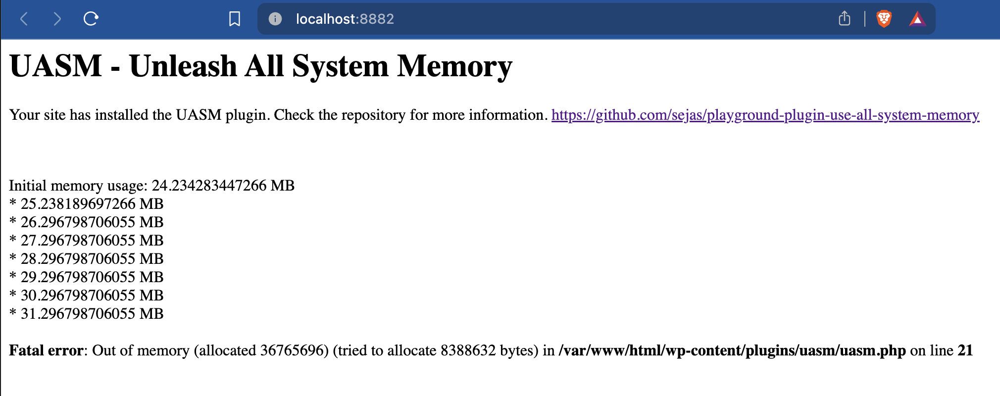

# UASM - Use All System Memory

Basic plugin that exhausts all the PHP WASM memory. Just for testing purposes.

This repository includes the [plugin source code](uasm.php), and the [plugin ZIP file](playground-plugin-use-all-system-memory.zip).

## How to use

This repository is designed for using the `raw` GitHub URLs to load both the plugin and the blueprint into the WordPress Playground.

### WordPress Playground URLs

- Loading the blueprint as URL fragment: [`https://playground.wordpress.net/{"landingPage":"/","steps":[{"step":"installPlugin","pluginZipFile":{"resource":"url","url":"https://raw.githubusercontent.com/sejas/playground-plugin-use-all-system-memory/main/playground-plugin-use-all-system-memory.zip"}}]}`](https://playground.wordpress.net/{"landingPage":"/","steps":[{"step":"installPlugin","pluginZipFile":{"resource":"url","url":"https://raw.githubusercontent.com/sejas/playground-plugin-use-all-system-memory/main/playground-plugin-use-all-system-memory.zip"}}]})
